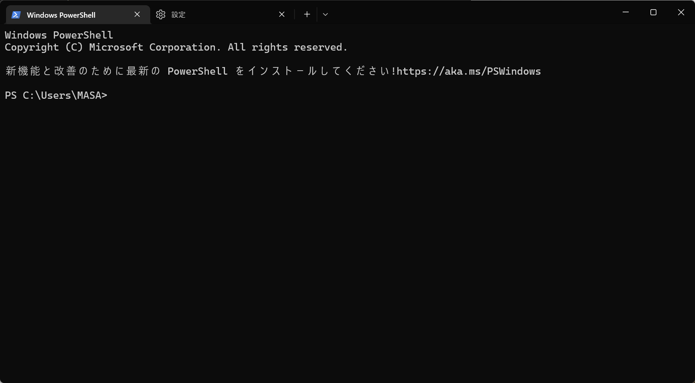
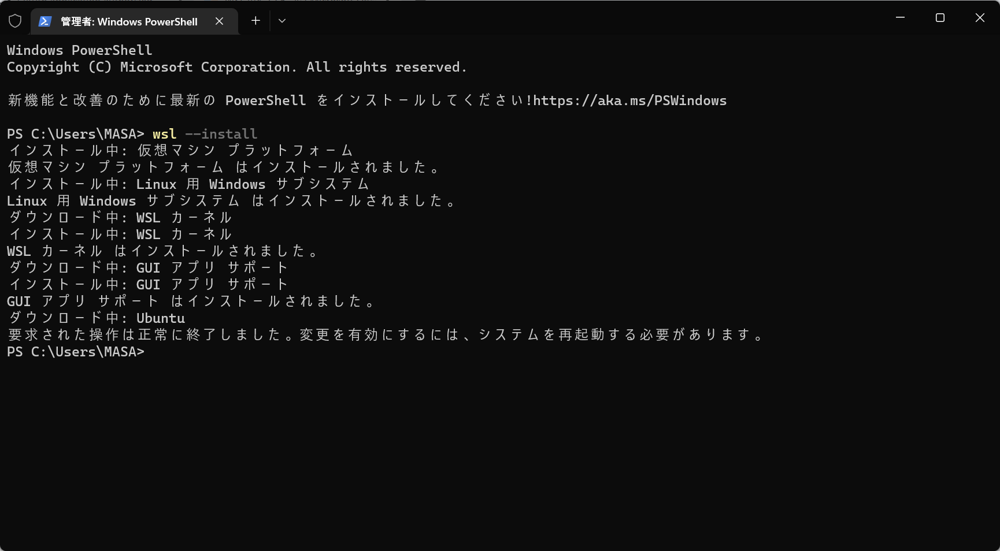
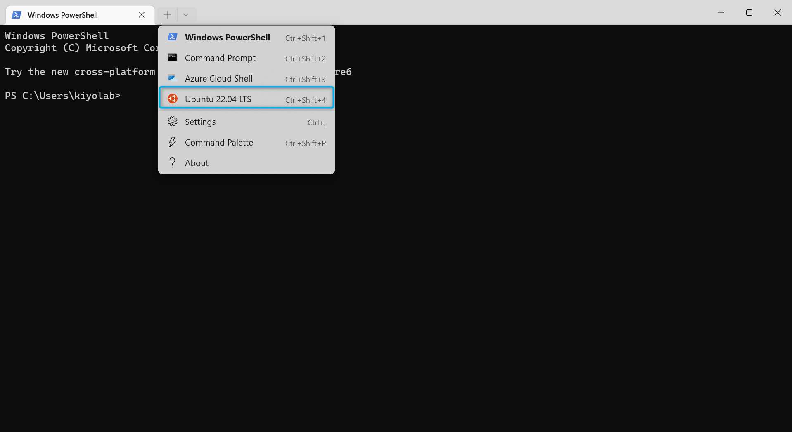
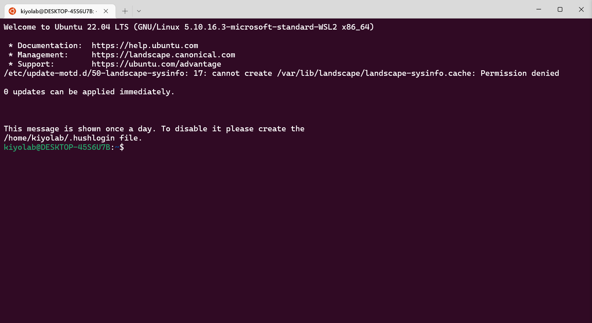
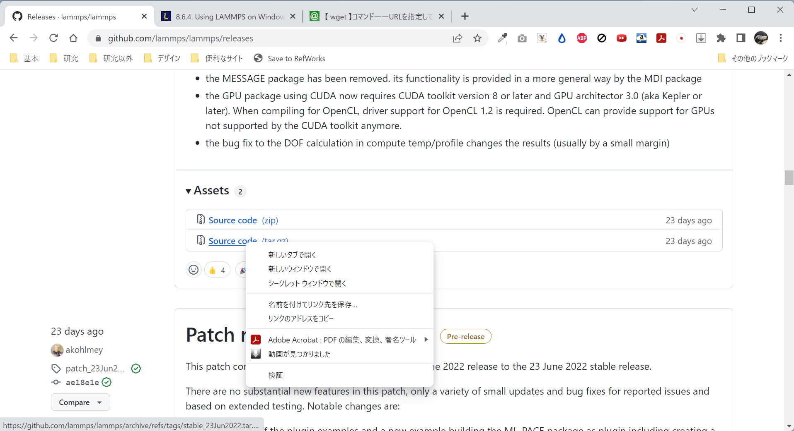
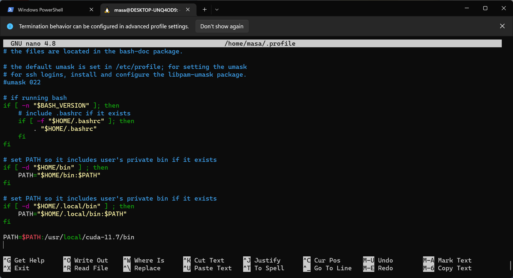
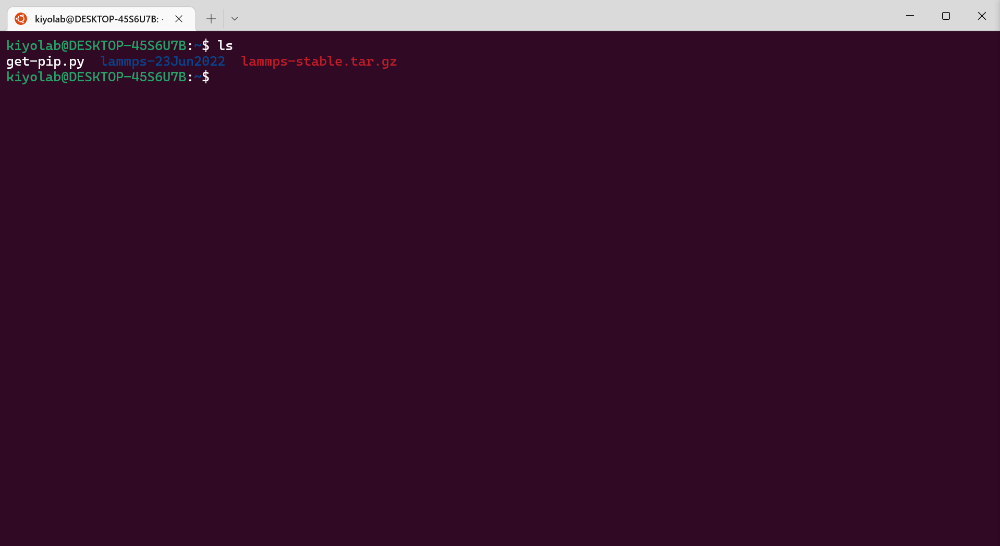
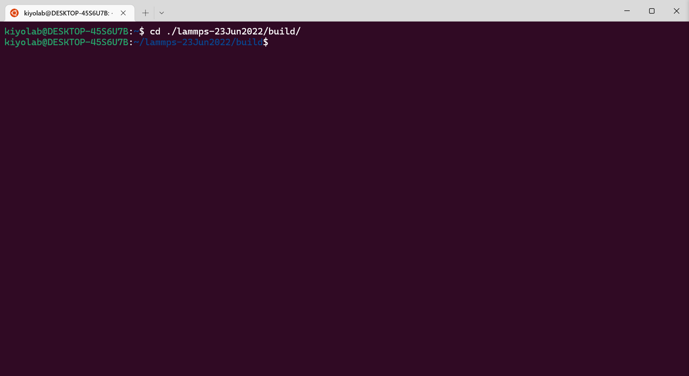
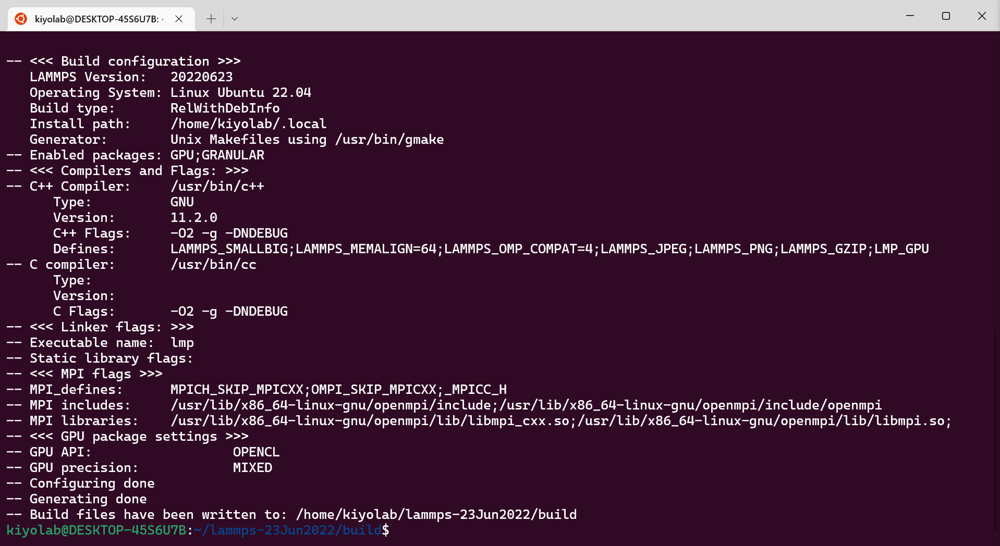
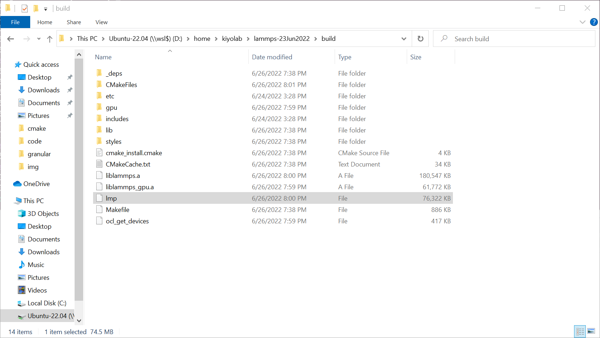

# 目次 (2022年7月16日時点)
- [目次 (2022年7月16日時点)](#目次-2022年7月16日時点)
- [はじめに](#はじめに)
- [WSL2とLAMMPSのセットアップ](#WSL2とlammpsのセットアップ)
  - [WSL2のインストール](#WSL2のインストール)
  - [LAMMPSのダウンロード](#lammpsのダウンロード)
    - [FFMPEGのインストール](#ffmpegのインストール)
  - [LAMMPSのビルド](#lammpsのビルド)
  - [cudaのインストール](#cudaのインストール)
    - [CUDA Toolkitのインストール](#cuda-toolkitのインストール)
- [VSCodeとWindows Terminalを起動する](#vscodeとwindows-terminalを起動する)
- [VSCodeでコードを書く](#vscodeでコードを書く)
- [20220626 作業メモ](#20220626-作業メモ)
  - [必要なモジュールを含めてLAMMPSをビルドする](#必要なモジュールを含めてlammpsをビルドする)
- [20220715 作業メモ](#20220715-作業メモ)
  - [GPUあるいはマルチスレッドの検証](#gpuあるいはマルチスレッドの検証)
    - [実行可能ファイルのファイル名の変更方法](#実行可能ファイルのファイル名の変更方法)
    - [KOKKOSインストール手順](#kokkosインストール手順)
    - [`mpirun -np 16`とGPUを変更した際の実行結果](#mpirun--np-16とgpuを変更した際の実行結果)
- [20220716 作業メモ](#20220716-作業メモ)
  - [研究室内の自分PCにwslをインストール使用としたがうまくいかない...](#研究室内の自分pcにwslをインストール使用としたがうまくいかない)
  - [bin2cエラー](#bin2cエラー)
- [TODO](#todo)

# はじめに
<<<<<<< HEAD
これは個別要素法(DEM, Discrete Element Model)のシミュレーションに用いられるLAMPPSというプログラムのチュートリアル用資料です。
DEMは粒状体である地盤材料と相性が良く、様々な地盤の解析で使用されるようになってきています。
中でもLAMPPSは化学の古典分子動力学の分野で古くから使われてきた実績があり、多くの論文でも解析ツールとして用いられています。

ただ、文字入力をベースとする解析手法であるため(CUIといいます)、マウスやアイコンといったGUIに慣れている人には少し使いにくいものかもしれません。
この資料ではなるべく分かりやすく手順を解説できればと考えています。もし質問や誤字脱字等ありましたら遠慮なく聞いてください。
=======

基本的に公式の[Document](https://docs.lammps.org/Manual.html)を参考にするようにしてください。英語ですがありえないぐらい充実しています。
>>>>>>> parent of d00fb8a... ver20220717-0027

基本的な解析の流れは以下の通りです。1は最初だけ、2~3を繰り返してやっていく形になります。

1. [WSL2とLAMMPSのセットアップ](#WSL2とLAMMPSのセットアップ)
2. [VSCodeでコードを書く](#VSCodeでコードを書く)
3. [実行可能ファイルを通しての解析]()

<<<<<<< HEAD
基本的にこの資料を読んでも分からない場合には、公式の[Document](https://docs.lammps.org/Manual.html)を参考にするようにしてください。英語で書かれていますが、内容はとんでもない充実度です。

=======
>>>>>>> parent of d00fb8a... ver20220717-0027
# WSL2とLAMMPSのセットアップ

WSL2(Windows Subsystem for Linux 2)というのは、WindowsのOS上にLinuxという別のOSを作ることができる機能です。

LAMPPSはLinuxベースで開発が進められているので、解析を始めるにはまずLinuxの環境を作る必要があります。
Linuxの環境を作るには現在大きく分けて二つの方法があります。

1. Linuxがインストールされたノートパソコンorデスクトップパソコンを準備する
2. WSL2によってWindows上にLinuxのOSを作ってしまう

1は2ほどめんどくさい事前準備(ここでは環境構築)が必要ないのですが、持つべき端末が1台増えてしまいます。そのため今回は2の方法で進めたいと考えています。

## WSL2のインストール

今回参考したのはMicrosoftの[公式ドキュメント](https://docs.microsoft.com/ja-jp/windows/wsl/install)です。
まず皆さんのノートパソコンあるいはデスクトップパソコン上で、デスクトップが開いている状態でWindowsキーを押して`windows terminal`と検索してください。
そうするとmicrosoft storeの画面が出てくると思いますので、windows terminalをインストールしてください。

インストール後もう一度windowsキーを押して、`windows terminal`と入力して**右クリックして管理者権限を与えて**windows terminalを起動してください。
そうするとWindows Powershellと左上に書かれた画面が表示されると思います。

 

そうしたら`>`の横に続けて以下のコマンドを入力して、エンターを押してください。
```bash
wsl --install
```
そうすると色々な文字が表れると思います。`システムを再起動する必要があります`という文が出ますので、PCを再起動しましょう。

 

再起動すると英語でユーザー名とパスワードを聞いてくる画面が自動で出てきます。ユーザー名は個人が特定されにくいものがいいでしょう。パスワードは入力しても何も画面には反映されませんが仕様です。再入力も同じのを入力するようにしましょう。

なお`ファイル システムの 1 つをマウント中にエラーが発生しました。詳細については、「dmesg」を実行してください。`というコメントが出た場合には、ユーザー名とパスワードの入力後に一旦画面を閉じて、管理者権限で起動したWindows Terminalの欄に次の2つのコマンドを一つずつ入力してください。

```bash
wsl.exe --update
wsl.exe --shutdown
```

これらの作業が終了したらWindows Terminalを開いた直後の状態から、上のタブの下矢印(v)をクリックしてください。そして`Ubuntu`あるいは`Ubuntu 22.04 LTS`をクリックしてください。
この状態でも`ファイル システム~`のメッセージが出る場合には、`dmesg | grep -i error`のコマンドを打った後の結果を見せてください。

 

これが終わったら次のような画面が表示されていると思います。

 

このUbuntu画面では`$`の後にコマンドという指令を出していくことで、データの操作を行っていきます。まず、Ubuntuの中身をアップデートする必要があるので次のコマンドを`$`の後に続けて打ち、一つずつ実行してください。 なおここからは基本的に[LAMMPSの公式サイト](https://docs.lammps.org/Howto_wsl.html)を参考にしていきます。

```bash
sudo apt update
sudo apt upgrade -y
```

続けてLAMMPSの実行に必要なパッケージをインストールしていきます。次のコマンドを打って実行してください。

```bash
sudo apt install -y cmake build-essential ccache gfortran openmpi-bin libopenmpi-dev \
                    libfftw3-dev libjpeg-dev libpng-dev python3-dev python3-pip \
                    python3-virtualenv libblas-dev liblapack-dev libhdf5-serial-dev \
                    hdf5-tools clang-format
```

## LAMMPSのダウンロード

次に行うのはLAMMPSのダウンロードです。公式HPには二つの方法がありますが、現時点(2022年7月16日)での最新版が`stable_23June2022`なので、このidと方法1でダウンロードしていきます。最新版のリリースは[こちら](https://github.com/lammps/lammps/releases)から確認できます。次のコマンドで使用するURLは各投稿の一番下にあるAssetsから右クリックすることで取得できます。

 

まず最初に`wget`コマンドを使用してファイルをダウンロードします。
```bash
wget https://github.com/lammps/lammps/archive/refs/tags/stable_23Jun2022.tar.gz
```

次に`tar`コマンドを使用して解凍します。
```bash
tar xvzf stable_23Jun2022.tar.gz
```

そして解凍してできたフォルダに移動します。
```bash
cd lammps-stable_23Jun2022
```

### FFMPEGのインストール

また次のコンパイル時にエラーが出ないようにするためにFFMEPGというパッケージもインストールしておきます。次のコマンドを1行ずつ実行してください。

```bash
sudo add-apt-repository ppa:mc3man/trusty-media
sudo apt-get update
sudo apt-get dist-upgrade
sudo apt-get install ffmpeg
```

## LAMMPSのビルド

次にLAMMPSのビルドを行います。まず今移動してきた`lammps-stable_23Jun2022`のフォルダの中に`build`というフォルダを作り、そちらに移動します。次のコマンドを1行ずつ実行してください。

```bash
mkdir build
cd build
```

ビルドの仕方はたくさんあり、後にも細かい設定を変えていくのですが、ひとまずデフォルトの設定でビルドをしてみたいと思います。`lammps-stable_23Jun2022`の中の`cmake`の中の`presets`というフォルダに、デフォルトのビルド設定が書かれたファイルがありますので、それを取ってきて構成します。これにより構成(Configuration)が終わり、Makefileという中間ファイルが作られます。(←たぶん正確な表現ではないと思われる...)

```bash
cmake ../cmake/presets/basic.cmake ../cmake
```

この後コンパイルをしていきます。
```bash
make -j 4
```
`-j 4`は何個の並列プロセスを走らせるかという意味です。自分のパソコンの物理コアに対応する数を入力するとコンパイルを早く終わらせることが出来ます。`[100%] Built target lmp`と最後に表示されればコンパイルは完成です。これで`build`のフォルダ内に実行可能ファイル`lmp`が作成されました。

## cudaのインストール
基本的な内容はここまでなのですが、いくつかシミュレーションの高速化に当たって有用なパッケージがあるのでそれをインストールしていきたいと思います。**外付けのGPGPU(NVidia GeforceやAMD Radion)等がPCに付属しており、かつ接触モデルに`gran/hooke/history`を用いる**場合には、KOKKOSというアクセラレータ(加速用)パッケージが使用できます。ここからはこのKOKKOSを使用するための環境構築手順を説明します。

なお今回の環境はGeforce GTX 1060を基準にして話をしていきます。

### CUDA Toolkitのインストール
基本的な流れは[Nvidia公式サイト](https://docs.nvidia.com/cuda/wsl-user-guide/index.html#getting-started-with-cuda-on-wsl)から見れます。しかし手持ちの環境だとうまくいかなかった箇所があったため、こちらにも書いていきたいと思います。

まず行うべきはNvidiaのドライバのダウンロードです。これはwsl上ではなくホストのwindows上で行います。こちらの[リンク](https://www.nvidia.com/Download/index.aspx?lang=en-us)からドライバをダウンロードしてインストールしてください。なお自分のPCのGPGPUについてはタスクマネージャーから確認できます。またwindowsキーを押して、'Nvidia Control Panel`と入力した場合に同じ名前のソフトが出てくるようであれば、この手順は飛ばしてもらって大丈夫です。

次からはWindows Terminal上のUbuntuの操作になります。まず次のコマンドを実行し、一番上の階層に移ります。
```bash
cd ~
```

そして次のコマンドを上から一つずつ実行していってください

```bash
wget https://developer.download.nvidia.com/compute/cuda/repos/wsl-ubuntu/x86_64/cuda-wsl-ubuntu.pin
sudo mv cuda-wsl-ubuntu.pin /etc/apt/preferences.d/cuda-repository-pin-600
sudo apt-key adv --fetch-keys https://developer.download.nvidia.com/compute/cuda/repos/wsl-ubuntu/x86_64/3bf863cc.pub
sudo add-apt-repository "deb https://developer.download.nvidia.com/compute/cuda/repos/wsl-ubuntu/x86_64/ /"
sudo apt-get update
sudo apt-get -y install cuda
```

最後にbin2cというファイルをwsl上のUbuntuに覚えて貰うために以下のコマンドを実行します。(pathへの追加)
```bash
sudo nano ~/.profile
```

そうすると次のような画面が出てくると思います。下矢印キーを押して一番下の行にカーソルを移動して、`PATH=$PATH:/usr/local/cuda-11.7/bin`を新しい行として追加してください。

 

入力が終わったら`ctrl+O`→`enter`→`ctrl+X`を押して、保存し元の画面に戻ってください。その後さらに
```bash
source ~/.profile
```
と先ほど入力したPathが反映される形となります。ここまでやればあともう一息です。
```bash
cd lammps-stable_23Jun2022/build/
```
と実行して、先ほどのビルドフォルダに移ります。そしてGPUパッケージ、GRANULARパッケージ、KOKKOSパッケージを有効化するために次のコードを実行し、コンパイルします。**ここで`GPU_ARCH=sm_61, Kokkos_ARCH_SKX=yes, Kokkos_ARCH_PASCAL61`の部分はPCの構成によって変更がある部分です。** [こちら](https://docs.lammps.org/Build_extras.html#available-architecture-settings)を参考に適切な文字列に置き換えてください。

```bash
cmake -D PKG_GPU=yes -D GPU_API=cuda -D GPU_ARCH=sm_61 -D PKG_GRANULAR=yes ../cmake
cmake -D PKG_KOKKOS=yes -D Kokkos_ARCH_SKX=yes -D Kokkos_ENABLE_OPENMP=yes ../cmake
cmake -D BUILD_OMP=yes -D Kokkos_ARCH_PASCAL61=yes -D Kokkos_ENABLE_CUDA=yes ../cmake
cmake -D CMAKE_CXX_COMPILER=${HOME}/lammps-stable_23Jun2022/lib/kokkos/bin/nvcc_wrapper ../cmake
```
```bash
make -j 4
```

これで特にエラーが出てこなければひとまずビルドは完成です！さらにこの実行可能ファイルをインストールします。

```bash
make install
```

インストール先は`~/.local/bin`となりますので、このパスを追加します。先ほどと同じようにnanoエディタで`.profile`を開きます。

```bash
sudo nano ~/.profile
```

ここの最終行に以下の文字列を追加します。
```bash
PATH=$PATH:$HOME/.local/bin
```
入力が終わったら`ctrl+O`→`enter`→`ctrl+X`を押して、保存し元の画面に戻ってください。その後さらに
```bash
source ~/.profile
```
と先ほど入力した内容が反映されます。このあと`lmp`とコマンドを打つと次のようなログが表示されれば成功です。
```bash
LAMMPS (23 Jun 2022)
OMP_NUM_THREADS environment is not set. Defaulting to 1 thread. (src/comm.cpp:98)
  using 1 OpenMP thread(s) per MPI task
```

# VSCodeでコードを書く
ひとまず2022/6/26時点で動くコードは[こちら](./sample.in)から。

まずコード全体の概観の説明をします。基本的にLAMMPSのコードは設計書だと思ってください。前の節で作成した実行可能ファイル(ゼネコン)にこの設計書を渡すことで、解析(建築作業)が始まります。コードは大きく分けて4つのセクションに分かれます。

1. 初期化：粒子や粒子を入れる箱を作る前のパラメータを決定します(単位、次元、境界条件、解析する粒子の種類など)
2. 系の定義：粒子や粒子を入れる箱、また粒子に作用する力に関する仕様を決定します。
3. 解析の定義：粒子や粒子を入れる箱、また粒子に作用する力に関するパラメータを決定します。
4. 実行：解析を実行します。
   
上にも書いた動くコードについて各行の意味を詳細に書きました。基本的にはこれを改良していくので問題ないかと思います。

# 20220626 作業メモ
##  必要なモジュールを含めてLAMMPSをビルドする
ここからはWindows Terminalの話になります。まず開いた直後の状態から上のタブの下矢印(v)をクリックしてください。そしてUbuntu 22.04 LTSをクリックしてください。
 
そうするとUbuntuのターミナル画面が表示されると思います。(PowerShellの方は使わないので×で消してもらって大丈夫です。)
 
今回のPCのUbuntuはCUI(キャラクタユーザインターフェース)なので、全部キーボードの入力で操作をしていきます。具体的には&#36;マークの続きにコマンド(指令)を入力し、その結果を見つつさらに新しいコマンドを打つ形になります。まずこの画面で`ls`と打ちエンターを押してみてください。ちなみに`ls`はlist segmentsの略です(&#36;と`ls`の間にあるスペースは自動で入っているものなので気にしないでください)。
そうすると次の文字列が出力されたと思います。

```bash
get-pip.py  lammps-23Jun2022  lammps-stable.tar.gz
```

 
このlsというコマンドは、今いるフォルダの中にあるファイルとフォルダをすべて表示する
というコマンドです。今回の場合get-pip.py、lammps-23Jun2022、lammps-stable.tar.gzの3つのファイルorフォルダが存在するため、このように表示されています。ちなみに文字色には意味があり、以下の通りです。

- 青：ディレクトリ
- 緑：実行可能または認識されたデータファイル
- スカイブルー：シンボリックリンクファイル
- 背景が黒の黄色：デバイス
- ピンク：グラフィック画像ファイル
- 赤：アーカイブファイル
- 背景が黒の赤：リンク切れ

次に出てきた入力欄に`cd ./lammps-23Jun2022/`と入力してみてください。ちなみに`cd ./l`まで打った後にtabキーを押すと、残りの文字列が自動で入力されます。(この機能は該当する候補が一つのみの時にしかできません)

これをすると&#36;の前の部分に`/lammps-23Jun2022`が加わったと思います。`cd`コマンドはchange directoryの略で、ディレクトリ(フォルダ)を移動できるコマンドです。つまり`cd ./lammps-23Jun2022/`コマンドによって、一つ下の階層のフォルダに移ることができるのです。

また一つ上の階層に戻りたいときは`cd ../`と打ちエンターキーを押すとできます。さらに続けて次の階層に降りたいときは、`cd ./lammps-23Jun2022/`と入力し **エンターキーを押さずに**そのままtabキーを押すと`lammps-23Jun2022`というフォルダの中にあるフォルダを一覧で表示できます。

さてここまで練習した機能を使って、`~/lammps-23Jun2022/build`のフォルダまで移動してください。するとこのような画面になると思います。

 

ここからLAMMPSのビルドという作業に移ります。ビルドは簡単に言うとプログラミング言語で
書かれたソースコードをもとにして、実行可能ファイルを作成することです。Windowsだとファイル名の一番後ろの拡張子が.exeとなったファイルをダウンロードすることがあるかと思います。ビルドとは人間が読める状態のソースコードから、exeファイルを作成する作業だと考えてください。

今回はcmakeというC言語あるいはC++プロジェクト向けのビルドツールを使います。ただそんなに難しい作業ではありません。コマンドラインに次の文字列を入力してください。

```bash
cmake -D PKG_GPU=yes -D GPU_API=cuda../cmake
cmake -D PKG_GRANULAR=yes ../cmake
cmake -D BUILD_MPI=yes ../cmake
```

`cmake`はこれからcmakeというビルド作業をするよ、という合図です。もう少し正確に言うと、`../cmake`にあるcmake用のスクリプトを読んできて、ビルドの構成を確認するというコマンドになります。

また`-D`オプションは、cmake用のスクリプトにおいて変数を変更(上書き)するためのコマンドです。そして`PKG_GPU=yes`の部分で、通常時には無効化されたGraphical User Interface(GPU)に関するパッケージを有効化してくださいという指令を書いています。同様に`PKG_GRANULAR=yes`では粒状体用のパッケージを有効化するという意味になります。`BUILD_MPI=yes`は並列処理によってビルドを行っていくださいという指令です。

このコマンドが終了すると、どのようなビルドが行われたのかのレポートが表示されます。最後の2行が

```bash
-- Generating done
-- Build files have been written to: /home/kiyolab/lammps-23Jun2022/build
```

となっていれば問題なく構成の変更ができています。出力結果はこんな感じです。

 

この次に、実際のbuildを行います。ここでは次のように入力します。

```bash
cmake --build . -j4
```

`.`はひとつ前のコマンドを行った`build`フォルダを指します。`-j4`はビルドに使用する際の並列プロセス数を指します。数字は使用しているPCのコア数によって変化させましょう。
これにより`build`フォルダの中にlmpという実行可能ファイルが生成されました。

 

ターミナルでも`./lmp`のコマンドを打つことによって確認できます。

```bash
LAMMPS (23 Jun 2022)
OMP_NUM_THREADS environment is not set. Defaulting to 1 thread. (src/comm.cpp:98)
  using 1 OpenMP thread(s) per MPI task
```

# 20220715 作業メモ
ここからは勉強過程で残した作業用メモです。参考になるかもしれないし、ならないかもしれません。

## GPUあるいはマルチスレッドの検証
GPGPUが本当にどれぐらい効くのか、またマルチスレッドはどのぐらい効くのか、それを検証した事例です。

### 実行可能ファイルのファイル名の変更方法
- 結論：よくわからなかった。cmakeのコマンドをいじれば実行可能ファイル名を変えられるはずなんだけど、CMakeLists.txtの中にもそれらしきものは見つからず...
- LAMMPS_BINARYやOUTPUT_NAMEに実行可能ファイル名が格納されているかもしれない。
  
### KOKKOSインストール手順
基本は[ここ](https://docs.lammps.org/Build_extras.html#kokkos)に書いてあるので参照するべし。
- 利用可能なアーキテクチャ一覧がある([こちら](https://docs.lammps.org/Build_extras.html#available-architecture-settings)から参照)
  - 今回の場合はRyzen 5950XとNVIDIA GeForce GTX 1650 or RTX 3090なのでArch-IDの中でも`ZEN3`と`TURING75`か`AMPERE86`が利用可能
    - `CC`はCompute Capabilityの略で[ここ](https://developer.nvidia.com/cuda-gpus)から参照可能
      - `AMPERE80`は過去の遺物?
  - `cmake`のビルド時に以下のコードの入力する必要がある
    - 連続して入力する場合には`cmake -D PKG_KOKKOS=yes -D Kokkos_ARCH_ZEN3=yes ../cmake`のようにする
    - 共通
      ```bash
      -D PKG_KOKKOS=yes
      ```
    - Zen3 CPU向け
      ```bash
      -D Kokkos_ARCH_HOSTARCH=yes  # HOSTARCHはここではZEN3
      -D Kokkos_ENABLE_OPENMP=yes
      -D BUILD_OMP=yes
      ```
    - NVIDIA CPU向け
      ```bash
      -D Kokkos_ARCH_GPUARCH=yes    # GPUARCHはここではTURING75かAMPERE86
      -D Kokkos_ENABLE_CUDA=yes
      -D CMAKE_CXX_COMPILER=${HOME}/lammps/lib/kokkos/bin/nvcc_wrapper
      ```
   
 - コンパイルする
   ```bash
   make -j 4
   ```
   - なんかいろいろ警告が出るけど大きく分けてこの2つ
     - `nvcc warning : The 'compute_35', ~~~`: nvccのコンパイラに`-Xcompiler "/wd 4819"`を渡せば解決するらしいが`cmake`からどのように設定するのか不明
       - 多分CMakeLists.txtを書き換えればいいのかな...
     - `warning #1675-D: unrecognized GCC pragma`: これもnvccのコンパイラに`-Xcudafe "--diag_suppress=unrecognized_gcc_pragma"`を通せばいいみたい

### `mpirun -np 16`とGPUを変更した際の実行結果

結果の前に実行した際の疑問点を以下に...
- OpenMPのスレッドはどのようにして増やす？？
- GPUが使われているようには思えないんだけど...
  - `mpirun -np 16 $LAMMPS_BUILD_DIR/lmp -sf gpu -pk gpu 1 -in in.pour.flatwall`の`-sf gpu -pk gpu 1`が肝心
  - ただメモリ使用量が増えるだけでCUDAは使われないようだ...
    - granularモジュールはCUDAを使えない??
    - 正解。各`pair_style`のコマンドの中に使用できるAcceleratorが書かれている(たとえば[granのページ](https://docs.lammps.org/pair_gran.html))
      - `granular`コマンドはいずれのAcceleratorも使えない
      - `gran/hooke`と`pair_style gran/hertz/history`コマンドは`omp`(OpenMP)のみ
      - `gran/hooke/history`コマンドは`omp`と`kk`(KOKKOS)のみ
      - でもそれぞれのコマンドの解説ページには以下のように書かれてる...
        - >Styles with a gpu, intel, kk, omp, or opt suffix are functionally the same as the corresponding style without the suffix.
    - じゃあKOKKOSってなによ...
      - どういう仕組みではやくなっているのかはよくわからない
      - ただインストール方法は[ここ](https://docs.lammps.org/Build_extras.html#kokkos)に書いてある
      - 長くなりそうなので[上](#kokkosインストール手順KOKKOSインストール手順)に記載
    - じゃあ`gran/hooke/history`とそれ以外のコマンドって何が違うのよ...
      - `history`はせん断応力が履歴をもたらすという意味らしい
        - $F_{hk}=\left(k_n\delta\boldsymbol{n}_{ij}-m_{eff}\gamma_n\boldsymbol{v}_n\right) - \left(k_t\Delta\boldsymbol{s}_t+m_{eff}\gamma_t\boldsymbol{v}_t\right)$のうちの$k_t\Delta\boldsymbol{s}_t$の部分
          - ここで$\Delta\boldsymbol{s}_t$は2粒子間の接線変位ベクトル(降伏関数を満たすように切り捨てたもの←ここ重要！)
          - 粘性によるエネルギー損失だけでなく塑性変形によるエネルギー損失が考慮できる！
            - 参考文献は[Brilliantov et al., 1996](https://journals.aps.org/pre/abstract/10.1103/PhysRevE.53.5382)か[瀬戸内, 2015](https://www.jstage.jst.go.jp/article/jsidre/83/4/83_I_133/_pdf/-char/ja)とか
          - しかし計算コストのかかりそうな`gran/hooke/history`のみがKOKKOSに対応しているのはなぜだ...
      - そもそも`granular`と`gran`の違いって何よ...
        - (まだ調べてない...)
- `mpirun -np 32`と設定するとエラーが出るんだけどなんで？？
  - `mpirun -np 16`が限界だったから物理コアに依存？
  - [ここ](https://www.open-mpi.org/doc/v4.0/man1/mpirun.1.php)を見ると`processing element`は何もオプションを指定しない場合はプロセッサーのコアになるらしい。
    - >By default, Open MPI defines that a "processing element" is a processor core. However, if --use-hwthread-cpus is specified on the mpirun command line, then a "processing element" is a hardware thread.

結果のまとめは以下の通り
- CPUのコア数は物理コア数まではほぼ律速
- `comm`にすごく時間がかかる場合がある
  - RyzenだからMCMの関係かも?(←自信はありません...)
- GPUは`PKG_GPU=on`にしてもメモリを使用するだけで全然速くならない
1. `100.0% CPU use with 1 MPI tasks x 1 OpenMP threads`

```bash
Section |  min time  |  avg time  |  max time  |%varavg| %total
---------------------------------------------------------------
Pair    | 4.4758     | 4.4758     | 4.4758     |   0.0 | 73.16
Neigh   | 0.8622     | 0.8622     | 0.8622     |   0.0 | 14.09
Comm    | 0.032106   | 0.032106   | 0.032106   |   0.0 |  0.52
Output  | 0.0011555  | 0.0011555  | 0.0011555  |   0.0 |  0.02
Modify  | 0.7174     | 0.7174     | 0.7174     |   0.0 | 11.73
Other   |            | 0.02894    |            |       |  0.47

Nlocal:           3000 ave        3000 max        3000 min
Histogram: 1 0 0 0 0 0 0 0 0 0
Nghost:            458 ave         458 max         458 min
Histogram: 1 0 0 0 0 0 0 0 0 0
Neighs:          16800 ave       16800 max       16800 min
Histogram: 1 0 0 0 0 0 0 0 0 0

Total # of neighbors = 16800
Ave neighs/atom = 5.6
Neighbor list builds = 1168
Dangerous builds = 0
Total wall time: 0:00:06
```

2. `100.0% CPU use with 2 MPI tasks x 1 OpenMP threads`

```bash
MPI task timing breakdown:
Section |  min time  |  avg time  |  max time  |%varavg| %total
---------------------------------------------------------------
Pair    | 1.0778     | 2.2797     | 3.4817     |  79.6 | 48.86
Neigh   | 0.33048    | 0.43536    | 0.54025    |  15.9 |  9.33
Comm    | 0.074782   | 1.4048     | 2.7348     | 112.2 | 30.11
Output  | 0.00052933 | 0.00078022 | 0.0010311  |   0.0 |  0.02
Modify  | 0.47923    | 0.51266    | 0.5461     |   4.7 | 10.99
Other   |            | 0.03222    |            |       |  0.69

Nlocal:           1500 ave        2037 max         963 min
Histogram: 1 0 0 0 0 0 0 0 0 1
Nghost:          461.5 ave         481 max         442 min
Histogram: 1 0 0 0 0 0 0 0 0 1
Neighs:           8459 ave       12697 max        4221 min
Histogram: 1 0 0 0 0 0 0 0 0 1

Total # of neighbors = 16918
Ave neighs/atom = 5.6393333
Neighbor list builds = 1170
Dangerous builds = 0
Total wall time: 0:00:04
```

3. `98.9% CPU use with 4 MPI tasks x 1 OpenMP threads`

```bash
Section |  min time  |  avg time  |  max time  |%varavg| %total
---------------------------------------------------------------
Pair    | 0.5379     | 1.1592     | 1.8082     |  56.4 | 44.26
Neigh   | 0.1653     | 0.21779    | 0.27634    |  10.9 |  8.32
Comm    | 0.11505    | 0.83398    | 1.5122     |  73.0 | 31.84
Output  | 0.00033634 | 0.00054757 | 0.0010141  |   0.0 |  0.02
Modify  | 0.36899    | 0.386      | 0.40115    |   2.2 | 14.74
Other   |            | 0.02164    |            |       |  0.83

Nlocal:            750 ave        1031 max         474 min
Histogram: 2 0 0 0 0 0 0 0 0 2
Nghost:         421.75 ave         467 max         378 min
Histogram: 2 0 0 0 0 0 0 0 0 2
Neighs:        4213.25 ave        6457 max        2040 min
Histogram: 2 0 0 0 0 0 0 0 0 2

Total # of neighbors = 16853
Ave neighs/atom = 5.6176667
Neighbor list builds = 1163
Dangerous builds = 0
Total wall time: 0:00:02
```

4. `98.9% CPU use with 8 MPI tasks x 1 OpenMP threads`

```bash
Section |  min time  |  avg time  |  max time  |%varavg| %total
---------------------------------------------------------------
Pair    | 0.14694    | 0.63576    | 1.0896     |  45.1 | 34.28
Neigh   | 0.061086   | 0.11576    | 0.15578    |  10.6 |  6.24
Comm    | 0.21373    | 0.69223    | 1.2642     |  49.1 | 37.33
Output  | 0.00044284 | 0.00065848 | 0.0012293  |   0.0 |  0.04
Modify  | 0.32495    | 0.37083    | 0.45551    |   8.2 | 20.00
Other   |            | 0.03922    |            |       |  2.12

Nlocal:            375 ave         559 max         197 min
Histogram: 2 1 1 0 0 0 1 1 0 2
Nghost:            323 ave         447 max         206 min
Histogram: 2 0 1 1 0 0 2 0 0 2
Neighs:        2118.12 ave        3673 max         731 min
Histogram: 2 0 2 0 0 0 1 1 0 2

Total # of neighbors = 16945
Ave neighs/atom = 5.6483333
Neighbor list builds = 1166
Dangerous builds = 0
Total wall time: 0:00:01
```

5. `99.0% CPU use with 16 MPI tasks x 1 OpenMP threads`

```bash
Section |  min time  |  avg time  |  max time  |%varavg| %total
---------------------------------------------------------------
Pair    | 0.039149   | 0.38002    | 1.494      |  73.3 | 14.98
Neigh   | 0.014347   | 0.072461   | 0.20876    |  23.5 |  2.86
Comm    | 0.18892    | 1.4073     | 1.8879     |  40.8 | 55.47
Output  | 0.00052081 | 0.0018748  | 0.0069923  |   4.7 |  0.07
Modify  | 0.39832    | 0.5047     | 0.6206     |   7.9 | 19.89
Other   |            | 0.1706     |            |       |  6.72

Nlocal:          187.5 ave         451 max          91 min
Histogram: 9 1 2 0 0 0 2 0 0 2
Nghost:        205.375 ave         384 max         102 min
Histogram: 4 2 2 2 1 1 2 0 0 2
Neighs:        1055.75 ave        3250 max         323 min
Histogram: 10 0 2 0 0 0 2 0 0 2

Total # of neighbors = 16892
Ave neighs/atom = 5.6306667
Neighbor list builds = 1162
Dangerous builds = 0
Total wall time: 0:00:02
```

6. `99.0% CPU use with 16 MPI tasks x 1 OpenMP threads` + GPU

```bash
Section |  min time  |  avg time  |  max time  |%varavg| %total
---------------------------------------------------------------
Pair    | 0.046393   | 0.41233    | 1.5131     |  76.5 | 15.28
Neigh   | 0.020617   | 0.11141    | 0.2955     |  28.9 |  4.13
Comm    | 0.35372    | 1.538      | 2.123      |  44.5 | 57.00
Output  | 0.00063928 | 0.0019649  | 0.0076661  |   5.0 |  0.07
Modify  | 0.34558    | 0.45745    | 0.55578    |   9.1 | 16.95
Other   |            | 0.1773     |            |       |  6.57

Nlocal:          187.5 ave         447 max         102 min
Histogram: 10 1 1 0 0 0 2 0 0 2
Nghost:        212.688 ave         402 max         111 min
Histogram: 5 1 2 2 2 0 2 0 0 2
Neighs:        1199.44 ave        3667 max         412 min
Histogram: 10 1 1 0 0 0 2 0 0 2

Total # of neighbors = 19191
Ave neighs/atom = 6.397
Neighbor list builds = 1155
Dangerous builds = 0
Total wall time: 0:00:04
```

# 20220716 作業メモ

## 研究室内の自分PCにwslをインストール使用としたがうまくいかない...
- `ファイル システムの 1 つをマウント中にエラーが発生しました。詳細については、「dmesg」を実行してください。`
  - [ここ](https://github.com/microsoft/WSL/issues/5680)を見たけど`wsl --update`でも改善しない...
  - `dmesg | grep -i error`(dmesgはLinuxカーネルが起動時に出力したメッセージを表示するコマンド)をやってみた
    ```bash
    [    2.678154] EXT4-fs (sdc): mounted filesystem with ordered data mode. Opts: discard,errors=remount-ro,data=ordered
    [    3.307626] init: (1) ERROR: MountPlan9WithRetry:285: mount drvfs on /mnt/f (cache=mmap,noatime,msize=262144,trans=virtio,aname=drvfs;path=F:\;uid=0;gid=0;symlinkroot=/mnt/
    [    3.967180] init: (1) ERROR: MountPlan9WithRetry:285: mount drvfs on /mnt/f (cache=mmap,noatime,msize=262144,trans=virtio,aname=drvfs;path=F:\;uid=0;gid=0;symlinkroot=/mnt/
    ```
  - なんか`path=F:\`っておかしくね...
  - Fドライブはフォーマットされていない8TBのHDDドライブ
  - 多分以前何かを入れておいて初期化したままになっていたみたい...
  - フォーマットしてバックアップドライブとして指定したら解決！(多分空き容量か何かで見てる？？)

## bin2cエラー
```bash
CMake Error at Modules/Packages/GPU.cmake:44 (message):
  Could not find bin2c, use -DBIN2C=/path/to/bin2c to help cmake finding it.
```
このエラーが無くならない
- 再インストールをしてもだめ
- bin2cへのパスを記入せよと言われているが、そのbin2cのファイルが見当たらない
  - everythingで探していたからだった...
    - everythingのオプション→検索データ→フォルダ→すべてをすぐに更新
    - データベースが更新され`\\wsl.localhost\Ubuntu\usr\local\cuda-11.7\bin\bin2c`にあることが分かった

## 別PCでやった(5950XとRTX3070)でのエラー
- `make -j 16`コンパイル中に以下のようなエラー
  ```bash
  cc1plus: error: bad value (‘znver3’) for ‘-march=’ switch
  cc1plus: note: valid arguments to ‘-march=’ switch are: nocona core2 nehalem corei7 westmere sandybridge corei7-avx ivybridge core-avx-i haswell core-avx2 broadwell skylake skylake-avx512 cannonlake icelake-client icelake-server cascadelake tigerlake bonnell atom silvermont slm goldmont goldmont-plus tremont knl knm x86-64 eden-x2 nano nano-1000 nano-2000 nano-3000 nano-x2 eden-x4 nano-x4 k8 k8-sse3 opteron opteron-sse3 athlon64 athlon64-sse3 athlon-fx amdfam10 barcelona bdver1 bdver2 bdver3 bdver4 znver1 znver2 btver1 btver2 native; did you mean ‘znver1’?
  ```
- gccのバージョンが低いことが理由
  - 下記のコードで解決できるらしいですが、理由までは調べ切れていません。
    ```console
    sudo apt install gcc-10 g++-10
    sudo update-alternatives --install /usr/bin/gcc gcc /usr/bin/gcc-10 100 --slave /usr/bin/g++ g++ /usr/bin/g++-10 --slave /usr/bin/gcov gcov /usr/bin/gcov-10
    sudo update-alternatives --config gcc
    ```


# TODO
1. 既往文献をあたる(国内でDEMをやられている先生はかなりいる、筑波大松島先生、名工大前田先生、土研大坪先生)
   1. マイクロパラメータ(粒子間剛性や粘性、使用している弾塑性モデル)がどのように設定されているのか
   2. 杭の挿入の際にどのような境界条件を変化させているのか
      1. 粉体工学のミルの設計に関する研究などが約に立つかもしれない
2. 適切な粒子数の設定
   1. DEMでは粒子数が多くなると解析に必要な時間が増える(解析時間と詳細度のトレードオフ)
   2. GPGPU(要はグラボ)を導入すると爆発的に速くなるらしいけど、詳細は不明。お金はあるので効果があるようだったら早急に購入したい。
3. 初期密度や間隙比をどのように調整するのか
4. 粒子に適切な重さを与えることができるのか
5. 境界面に作用する応力をデータとして吐き出すことができるのか
6. このREADMEの情報追加
   1. WSL2のUbuntuセットアップ手順
   2. LAMMPSのインストール手順


   