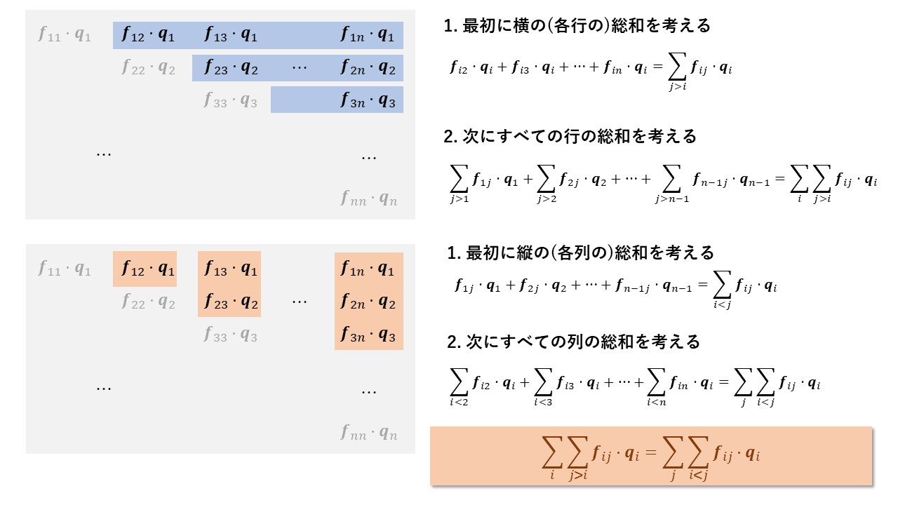

# ビリアル応力の説明
2022年8月8日時点でアンダーバー周辺のレンダリングにより、Github上で正しく表示されない現象を確認しています。VSCode等の他のMarkdownエディタで開いてみてください。

## ビリアルの定義と時間微分
まず天下りですが、以下のような物理量 $G$ を定義します。

$$
G = \sum_i \boldsymbol{p}_i \cdot \boldsymbol{q}_i
$$

ここで $\boldsymbol{p}_i$ は $i$ 番目の粒子の運動量、 $\boldsymbol{q}_i$ は $i$ 番目の粒子の位置ベクトルを指します。ここで両辺を時間微分してみます。

$$
\frac{\partial G}{\partial t} = \sum_i \frac{\partial \boldsymbol{p}_i}{\partial t} \cdot \boldsymbol{q}_i + \sum_i \boldsymbol{p}_i \cdot \frac{\partial \boldsymbol{q}_i}{\partial t} \tag{1}
$$

この式の右辺について詳しく見ていきます。

## $\frac{\partial \boldsymbol{p}_i}{\partial t}$ について

まず右辺第1項の $\partial p_i / \partial t$ の項についてはニュートンの第2法則より

$$
\sum_i \frac{\partial \boldsymbol{p}_i}{\partial t} \cdot \boldsymbol{q}_i = \sum_i m_i \frac{\partial \boldsymbol{v}_i}{\partial t} \cdot \boldsymbol{q}_i = \sum_i \boldsymbol{f}_i \cdot \boldsymbol{q}_i \tag{2}
$$

となります。ここで $m$ は粒子の質量、 $\boldsymbol{f}_i$ は粒子 $i$ に作用する力です。
次にこの $\boldsymbol{f}_i$ を内力と外力に分けていきます。内力は粒子 $j$ から粒子 $i$ に作用する力を $\boldsymbol{f}_{ij}$ とします。
また外力を $\boldsymbol{f}_i^\mathrm{ext}$ とします。すると $\boldsymbol{f}_i$ は次のように分解できます。

$$
\boldsymbol{f}_i = \sum_{j \neq i} \boldsymbol{f}_{ij} + \boldsymbol{f}_i^\mathrm{ext} \tag{3}
$$

よって式 $\mathrm{(2)}$ と $\mathrm{(3)}$ によって、

$$
\begin{aligned}
\sum_i \frac{\partial \boldsymbol{p}_i}{\partial t} \cdot \boldsymbol{q}_i &= \sum_i \left\{ \left( \sum_{j \neq i} \boldsymbol{f}_{ij}  + \boldsymbol{f}_i^\mathrm{ext} \right) \cdot \boldsymbol{q}_i \right\}  \tag{4} \\
&= \sum_i \sum_{j \neq i} \boldsymbol{f}_{ij} \cdot \boldsymbol{q}_i + \sum_i \boldsymbol{f}_i^\mathrm{ext} \cdot \boldsymbol{q}_i
\end{aligned}
$$

となります。式 $\mathrm{(4)}$ の第1項についてもう少し式変形をしていきたいと思います。簡略化のため $1 \leq i, j \leq 3$ の場合を考えます

$$
\begin{aligned}
\sum_i \sum_{j \neq i} \boldsymbol{f}_{ij} \cdot \boldsymbol{q}_i = \boldsymbol{f}_{12} \cdot \boldsymbol{q}_1 + \boldsymbol{f}_{13} \cdot \boldsymbol{q}_1 + \boldsymbol{f}_{21} \cdot \boldsymbol{q}_2 + \boldsymbol{f}_{23} \cdot \boldsymbol{q}_2 + \boldsymbol{f}_{31} \cdot \boldsymbol{q}_3 + \boldsymbol{f}_{32} \cdot \boldsymbol{q}_3 \\
\end{aligned}
$$

ここで例えば、 $\boldsymbol{f}_{12}=-\boldsymbol{f}_{21}$ であることを利用すると

$$
\begin{aligned}
\mathrm{(right \ side)} &= \left( \boldsymbol{f}_{12} \cdot \boldsymbol{q}_1 - \boldsymbol{f}_{12} \cdot \boldsymbol{q}_2 \right) + \left(\boldsymbol{f}_{13} \cdot \boldsymbol{q}_2 - \boldsymbol{f}_{13} \cdot \boldsymbol{q}_3 \right) + \left( \boldsymbol{f}_{23} \cdot \boldsymbol{q}_2 - \boldsymbol{f}_{23} \cdot \boldsymbol{q}_3 \right) \\
&= \boldsymbol{f}_{12} \cdot \left( \boldsymbol{q}_1 - \boldsymbol{q}_2 \right) + \boldsymbol{f}_{13} \cdot \left( \boldsymbol{q}_1 - \boldsymbol{q}_3 \right) + \boldsymbol{f}_{23} \cdot \left( \boldsymbol{q}_2 - \boldsymbol{q}_3 \right) \\
&= \boldsymbol{f}_{12} \cdot  \boldsymbol{q}_{12} + \boldsymbol{f}_{13} \cdot \boldsymbol{q}_{13}  + \boldsymbol{f}_{23} \cdot \boldsymbol{q}_{23} \\
&= \sum_i \sum_{j > i} \boldsymbol{f}_{ij} \cdot  \boldsymbol{q}_{ij}
\end{aligned}
$$

と整理できます。2行目から3行目への式変形では相対位置ベクトル $\boldsymbol{q}_{12} = \boldsymbol{q}_1 - \boldsymbol{q}_2$ を新しく定義しました。相対位置ベクトルと作用反作用の法則を用いることで同じ力の項がまとめることが出来ました。これと同じことが一般化した場合でも可能です。

$$
\begin{aligned}
\sum_i \sum_{j \neq i} \boldsymbol{f}_{ij} \cdot \boldsymbol{q}_i &= \sum_i \left( \sum_{j < i} \boldsymbol{f}_{ij} + \sum_{j > i} \boldsymbol{f}_{ij}\right)\cdot \boldsymbol{q}_i \\
&= \sum_i \sum_{j < i} \boldsymbol{f}_{ij} \cdot \boldsymbol{q}_i + \sum_i \sum_{j > i} \boldsymbol{f}_{ij}\ \cdot \boldsymbol{q}_i \\
&= \sum_i \sum_{j < i} \boldsymbol{f}_{ij} \cdot \boldsymbol{q}_i + \sum_j \sum_{i < j} \boldsymbol{f}_{ij}\ \cdot \boldsymbol{q}_i \\
&= \sum_i \sum_{j < i} \boldsymbol{f}_{ij} \cdot \boldsymbol{q}_i - \sum_j \sum_{i < j} \boldsymbol{f}_{ji}\ \cdot \boldsymbol{q}_i \\
&= \sum_i \sum_{j < i} \boldsymbol{f}_{ij} \cdot \boldsymbol{q}_i - \sum_i \sum_{j < i} \boldsymbol{f}_{ij}\ \cdot \boldsymbol{q}_j \\
&= \sum_i \sum_{j < i} \boldsymbol{f}_{ij} \cdot \left( \boldsymbol{q}_i -\boldsymbol{q}_j \right) \\
&= \sum_i \sum_{j < i} \boldsymbol{f}_{ij} \cdot \boldsymbol{q}_{ij} \tag{5}
\end{aligned}
$$

2行目から3行目への式変形では次の図のように内積の全要素の総和を取る際に2通りの手法があることを用いています。また3行目から4行目の式変形では作用反作用の法則、4行目から5行目の式変形では添え字の交換を行っています。
 

次に式 $\mathrm{(4)}$ の第2項について検討していきます。

$$
\begin{aligned}
\sum_i \boldsymbol{f}^\mathrm{ext}_i  \cdot \boldsymbol{q}_i &=  -\int \boldsymbol{r} \cdot (P\boldsymbol{n}) \  dA \\
&= -P \int_V \nabla \cdot \boldsymbol{r} dV \\
&= -3PV
\end{aligned}
$$

このように